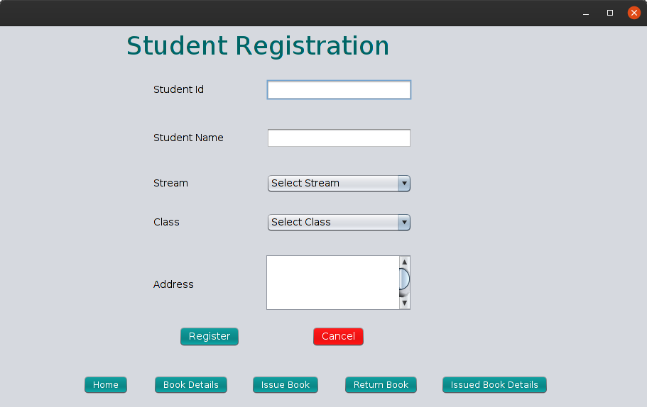
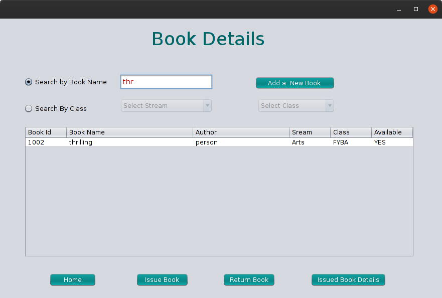
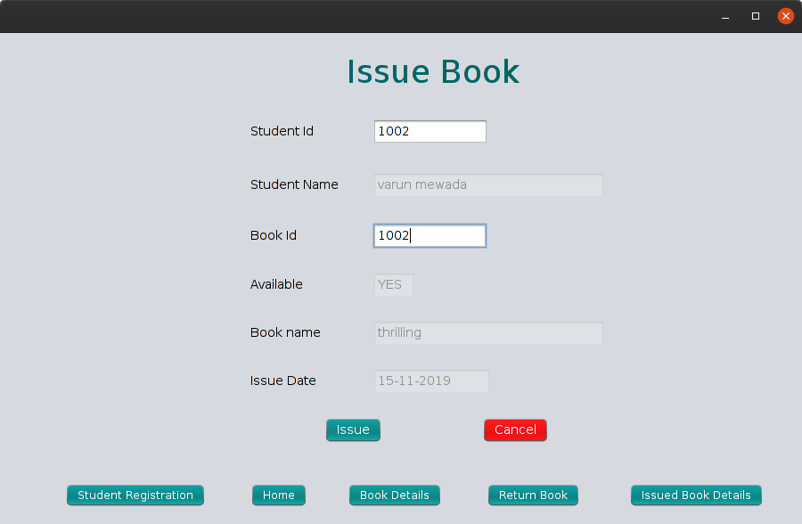
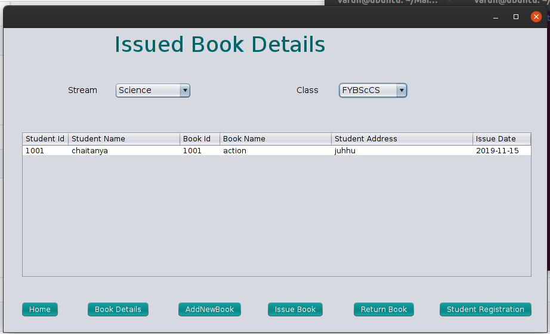
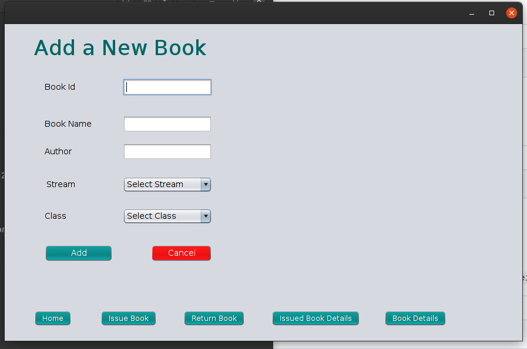

# <b>Library Management System :-</b>

### <li> Created Simple Library Management System Using Java Swing.</li>

#

### 
 Home Screen 

### 
 Student Registration 

### 
 Book Details 

### 
 Issue Book 

### 
 Issued Book Details

### 
 Add New Book 

